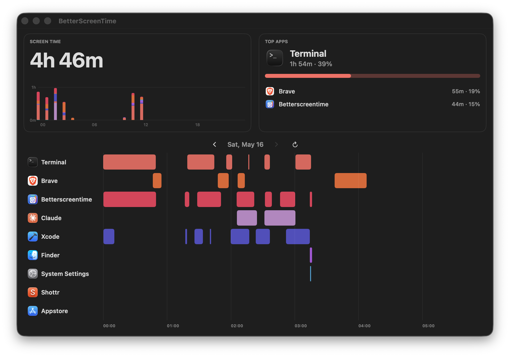
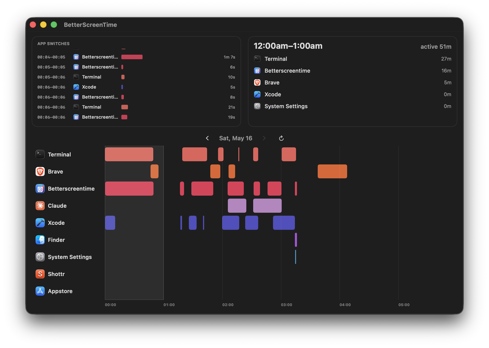
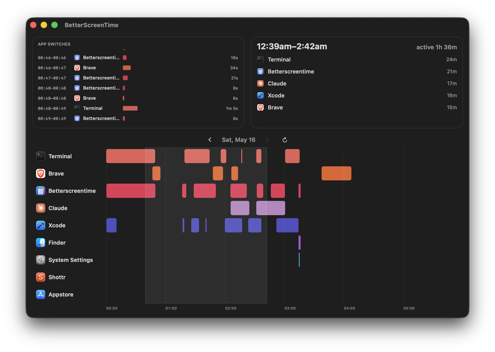
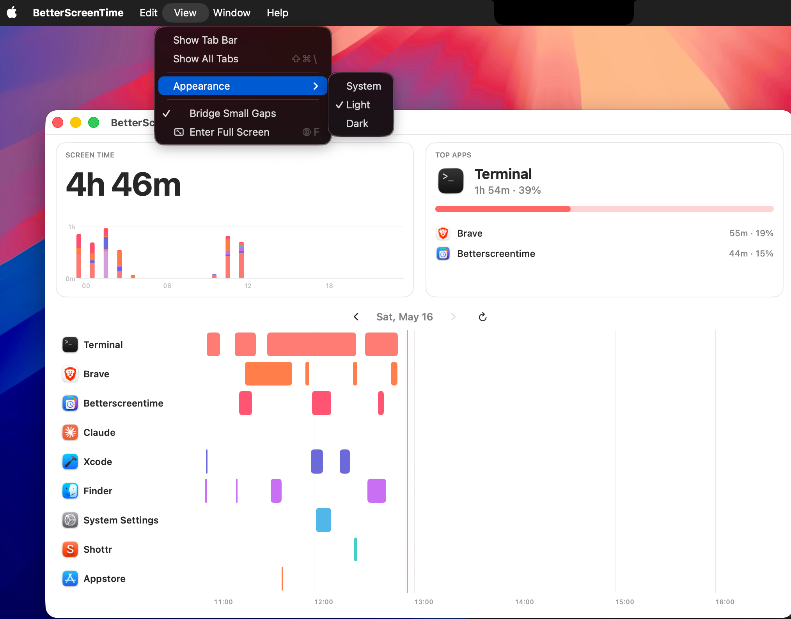

# BetterScreenTime

BetterScreenTime is a native macOS app to visualize your daily screen time with interactive timelines and charts.
- It is free, will always be free
- Collects no data
- Does not connect to the internet
- Need not run in the background

## Features
- Daily app usage tracking
- Timeline/Gantt-style activity view
- Hourly view for detailed usage patterns
- Light and dark mode support

## Installation
1. Go to the repository's **Releases** page.
2. Download the latest `.dmg` from **Assets**.
3. Open the DMG and drag **BetterScreenTime** into **Applications**.
4. Launch the app from **Applications**.

## Permissions
On first launch, macOS will ask permission for Full Disk Access this is needed to get data from the native screen time database, that is inside your library/

## Screenshots

### Dark Mode - Default View

### Dark Mode - Hour View

### Dark Mode - Shift + Drag View

### Light Mode - View Options

## Version
Current release tag: **1.0.0**
